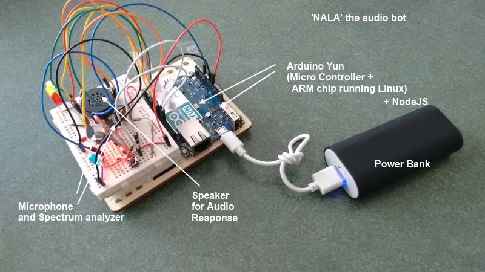
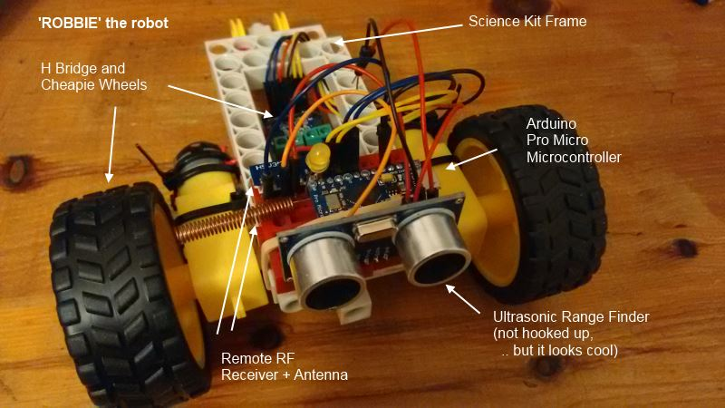
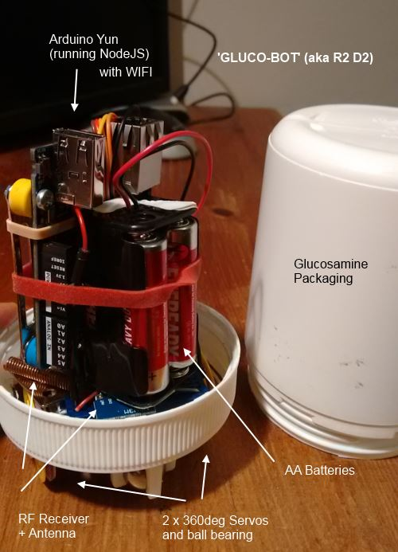
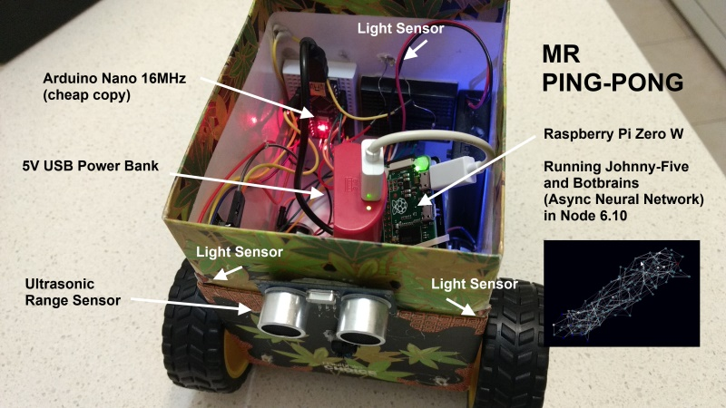

# robotics

I make stuff. Sometimes it works and I put the code here. 

I mostly use JavaScript (NodeJS) and C++ (Arduino), bit of bash for Linux scripting. 

There is random code for Microcontrollers, Sensors, Raspberry Pi, OpenWrt, RF, Bluetooth, Audio, Motor Controllers and Artificial Learning. Whatever I can get my hands on and figure out how it works.

## Audio Bot

This one was my first attempt at using NodeJS to communicate between Analog inputs and Linux CPU using the Arduino Yun's Bridge library. This wouldnt have happened without help from the very talented James Fox who got the spectrum analyzer chip sorted with his oscillometer and some spare capacitors he pulled out of an old PC. 

## Simplebot v1 (Node bot)

Fabrication is not my strong point. 

This one was built [using instructions](https://github.com/nodebotsau/simplebot) from much admired tinkerer [Andrew Fisher](https://github.com/ajfisher). He had a couple of great [youtube videos](https://www.youtube.com/watch?v=KoACCjtkHIg&feature=youtu.be) that were very helpful too.

## Bluetooth communication

This was useful as it helped me understand that Bluetooth makes it really easy to abstract communication, once you get it going it works as if you had a USB cable connected. 

Pity its so hard to setup in the first place, and that the connection is usually pretty flakey. I ended up using cheapie RF transmitter/receiver pairs instead, which also improve the battery life.

## Simplebot v2 (RF Bot)

I rebuilt the simplebot, and rewrote the Arduino code to add an RF receiver for the joystick controller below. 

I still feel guilty I pinched Andrew's joystick module from [Nodebots AU](http://nodebotsau.io/) but I will return someday soon (promise). Its all for a good cause.

## Joystick RF Controller (v1)

This is the joystick controller to move the simplebot above.

## Joystick RF Controller (v2)

I added two buttons (green and red for positive and negative feedback), so that I can train the AI for my next project.

## Gluco-bot (aka R2-D2)

Still work in progress. 

He's called Gluco-bot because thats a re-purposed package of glucosamine tablets.

I was a bit too ambitious trying to cut down on size - it doesnt fit in the case basically, I'm thinking AAA batteries instead of AA might do it.

## Pattern Recognition Trainer

A pretty basic setup that allows me to capture environmental sensor data and feed it into a pattern-recognition engine I'm building.

I want the next guy I build to do stuff on his own. Aiming for amoeba-level intelligence.

## Scooterbot

After giving up on Gluco-bot, I transferred the parts out to a new enclosure I bought. 

This one was made of cardboard so it was easier to cut out the holes for the servo-motors and zip-tie them in place. I also added some cool-cat glasses and held them up with bluetack and a pair of magnets.

## Mr Ping-Pong

I had an idea to build a nodebot with some sensors and plug them into a [neural network project](https://github.com/sdesalas/botbrains) I was working on.

I found a discarded cardboard teabox with a nice pattern on it and I cut out some holes for the wheels, then added the rest of the guts including some photo-sensors and a HCSR04 ultransonic range finder. 

The robot was 'alive' in the sense that all data was being sent to a neural network that processed it and fed commands to the motors, reinforcing all recent actions that increased the exposure to light. 

In other words, a 'light-seeking' robot. The code can be found [here](mr_pingpong/index.js).
