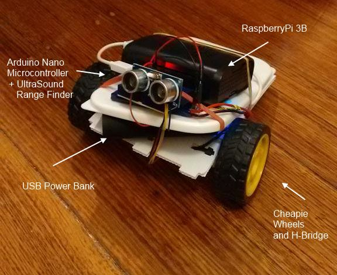
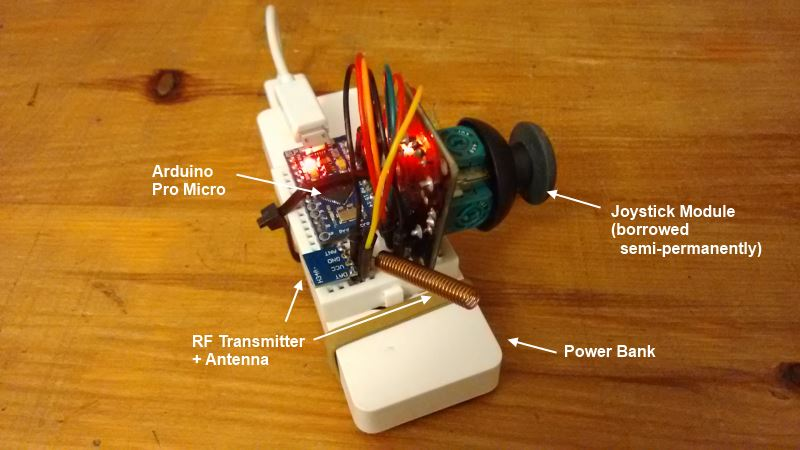
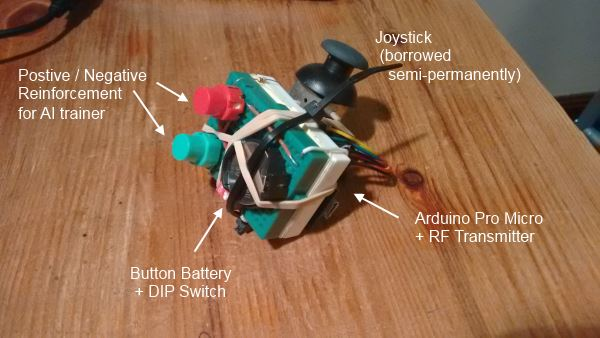

# robotics

I make stuff that moves. Sometimes it works. Then I put the code here. 

I mostly use JavaScript (NodeJS) and C++ (Arduino), bit of bash for Linux scripting. 

There is random code for Microcontrollers, Sensors, Raspberry Pi, OpenWrt, RF, Bluetooth, Audio, Motor Controllers and Artificial Learning. Whatever I can get my hands on and figure out how it works.

## Audio Bot

This one was my first attempt at using NodeJS to communicate between Analog inputs and Linux CPU using the Arduino Yun's Bridge library.

## Simplebot v1 (Node bot)

Fabrication is not my strong point. 

This one was built [using instructions](https://github.com/nodebotsau/simplebot) from much admired tinkerer [Andrew Fisher](https://github.com/ajfisher). 

## Bluetooth communication

This was useful as it helped me understand that Bluetooth makes it really easy to abstract communication, once you get it going it works as if you had a USB cable connected. Pity its so hard to setup in the first place, and that the connection is usually pretty flaky.

## Simplebot v2 (RF Bot)

I rebuilt the simplebot, and rewrote the Arduino code to add an RF receiver for the joystick controller below. 

I still feel guilty I pinched Andrew's joystick module from [Nodebots AU](http://nodebotsau.io/) but I will return someday soon (promise). Its all for a good cause.

## Joystick RF Controller (v1)

This is the joystick controller to move the simplebot above.

## Joystick RF Controller (v2)

I added two buttons (green and red for positive and negative feedback), so that I can train the AI for my next project.

## Gluco-bot (aka R2-D2)

Still work in progress. 

He's called Gluco-bot because thats a re-purposed package of glucosamine tablets.

I was a bit too ambitious trying to cut down on size - it doesnt fit in the case basically, I'm thinking AAA batteries instead of AA might do it.

