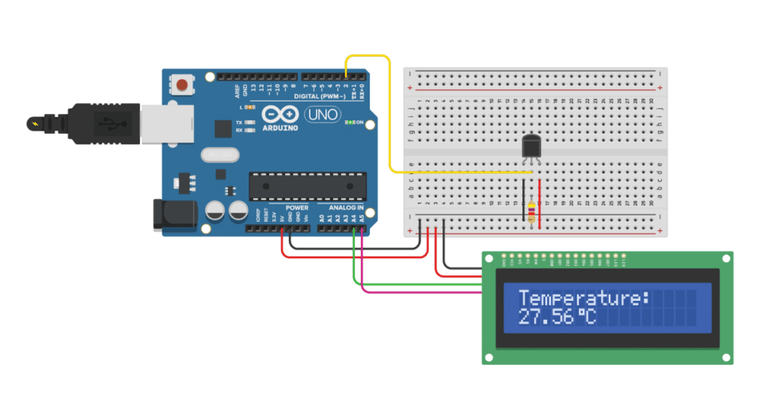

# Climate control circuit (Fan + Thermostat)

This is a climate control circuit to use external temperature to modulate indoor temperature.

# Components

- 1x Pro Micro ATmega32U4 5V 18Mhz 
- 2x DS18B20 waterproof temperature sensors
- 1x 25W 100mm inline "duct" fan mounted on external air conduit
- 1x 220V relay/octocoupler for 5V circuits
- 1x I2C LCD Screen   

## 1x Pro Micro ATmega32U4 5V 18Mhz 

## 2x DS18B20 waterproof temperature sensors

## 1x 25W 100mm inline "duct" fan

## 1x 220V relay/octocoupler for 5V circuits

## 1x I2C LCD Screen  

# Hookup (LCD)

Its much easier to setup an LCD using I2C, using 2 data cables instead of 6. 

# Hookup (Multi Sensor)

Using the "OneWire" protocol its possible to hook up multiple sensors on the same signal line.

