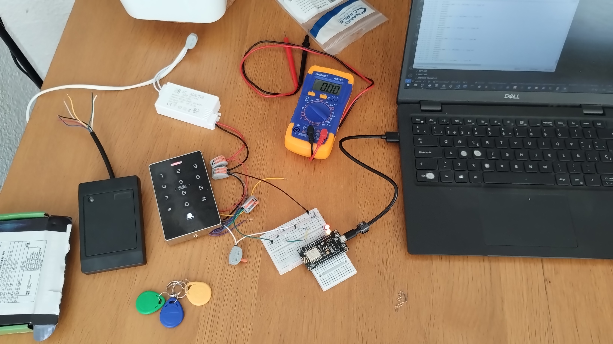
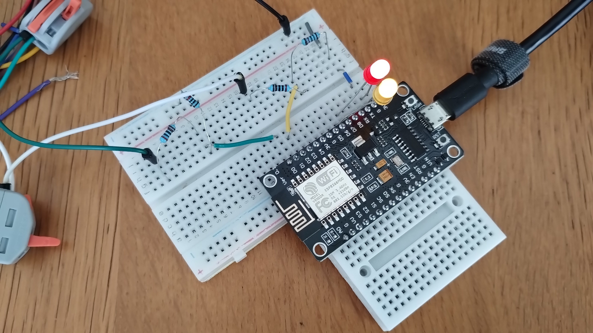

# Wiegand Tests

Various tests for commercially available and cost-effective Wiegand ID/IC card readers.

- [ID/IC Card Reader With Keypad](https://www.aliexpress.com/item/1005006242176757.html)
- [ID Card Reader (No Keypad)](https://www.aliexpress.com/item/1005005890917861.html)

The idea is to be able to run 2 wiegand readers (one with keypad) connected to a central access control ESP8266 node that can be managed via HTTP/Browser over WiFi.





Amazingly enough, after some tests I discovered that you can connect these 12v devices using a 10K Ohm resistor pulling excess voltage to ground. So that the microcontroller only receives 3.7V that its rated for.

```

----------------------------- 12V ground ------------|
                                                     |
--- 12V+ (signal) ---|                               |
                     |                               |
                     |                               |
              2K ohm resistor                        |
                     |                               |
                     |----------- 10K ohm resistor --|
                     |                               |
        |--------------------|                       |
        |            D1      |                       | 
        |                    |                       |
        | <microcontroller>  |                       |
        |                    |                       |
        |                 G  |                       |
        |---------------------                       |
                          |                          |
                          ---------------------------|

```